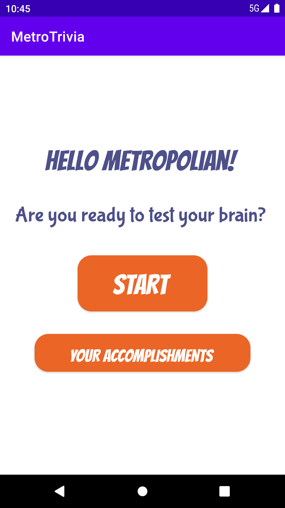
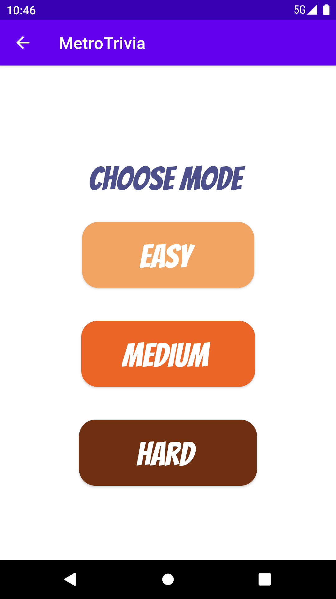
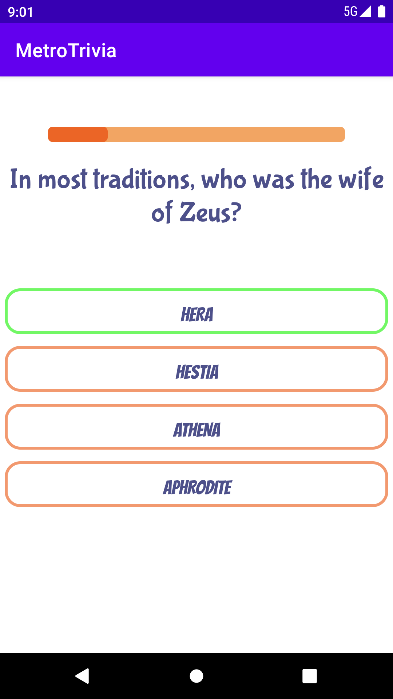
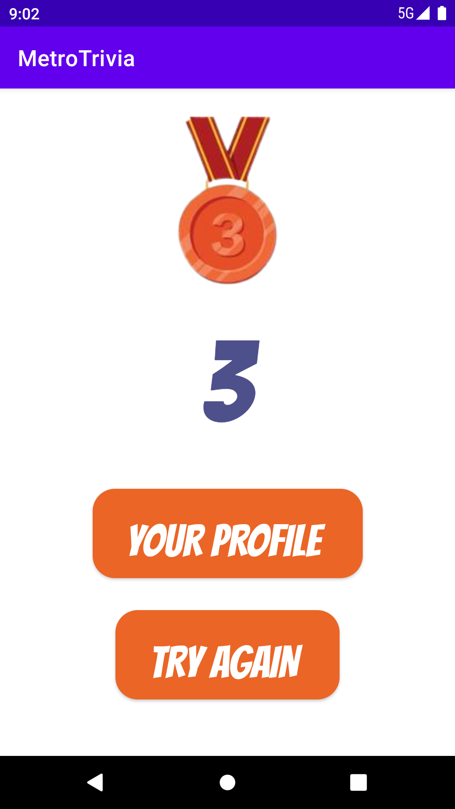
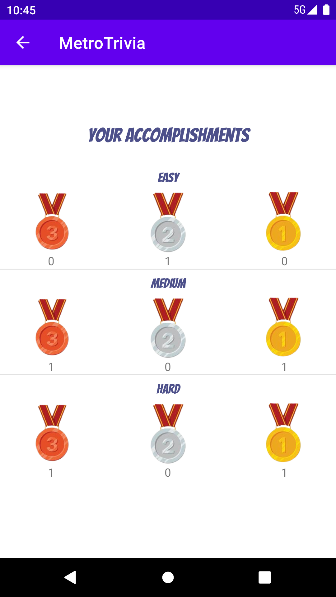

# Metrotrivia - A Java & Android project

  
  
  
  
  

## A school project to learn how to develop an Android application from scratch using Java. 

### This is a team project and my parts are:
* Design layouts, write XML files
* Deserialize JSON files
* Build logic for the whole application, using Java classes, Singleton, ListView with custom BaseAdapter, multiple activities
* Save user data using Shared Preferences

### Activities description
#### activity_main
An activity where an user can start a game session by moving on to "Choose mode" activity" or check his/her accomplishments

#### activity_chose_mode
An activity where an user can choose the desired mode including Easy, Medium and Hard.

#### activity_the_game
An activity where an user can play the game. Every game session includes 5 random questions. A question can be either true/false or multiple choice type.

#### activity_game_end
An activity where user see their result. If there are less than 3 correct answers, no medal is given. The user will be rewarded with bronze medal - 3 correct answers or silver medal - 4 correct answers or gold medal  - 5 correct answers. From this activity, the user can choose to see their profile or restart a game session

#### activity_profile_screen
An activity where user can see all the medals that they have acquired.
